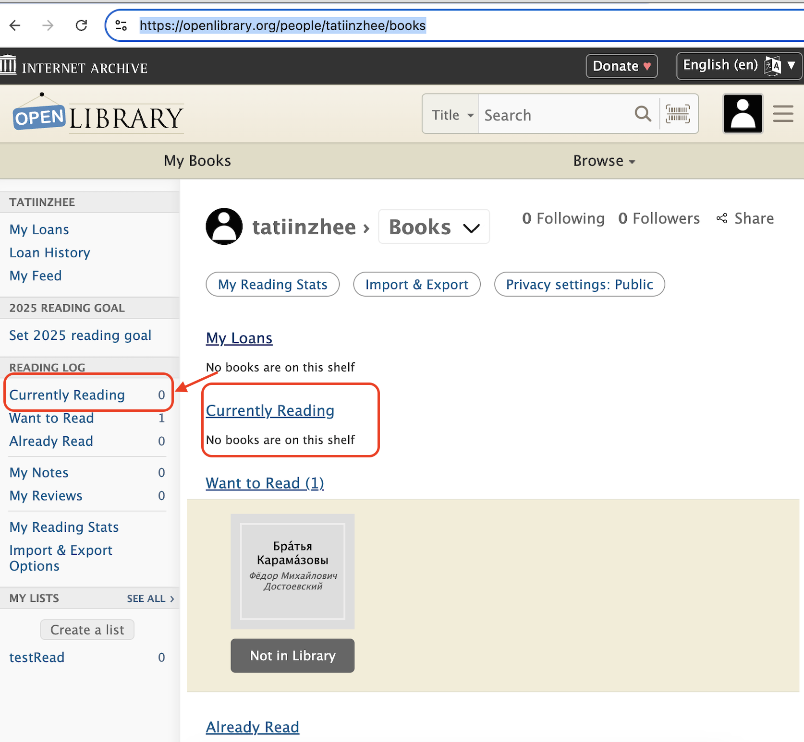

# Playwright Test Automation Project

## Overview
This project automates UI and API testing using [Playwright](https://playwright.dev/). It covers login, book search, and validation of "Currently Reading" books on [Open Library](https://openlibrary.org).

## Tech Stack
- [Playwright](https://playwright.dev/) for test automation
- TypeScript for scripting
- Jest for assertions

## Project Structure
```
├── tests/API/Books
│   ├── books.test.ts            # Tests books API Schema
│   ├── search.ts                # Endpoint function library test cases
│   ├── searchByISBN.spec.ts     # Test data for checkBookbyISBN test
│   ├── searchByTitleAndAutor.spec.ts # Searching book by title and get author key
├── tests/UI/other
│   ├── readBookCTA.spec.ts      # Tests for the Read CTA
├── tests/UI/search
│   ├── advancedSearch.spec.ts   # Tests for advanced search
│
├── pages/
|   ├── AdvancedSearchPage.ts   # Page Object for Advanced Search Page
|   ├── AuthorPage.ts           # Page Object for Author Page
│   ├── HomePage.ts             # Page Object for Home Page
│   ├── LoginPage.ts            # Page Object for Login Page
│   ├── MyBooksPage.ts          # Page Object for My Books Page
│   ├── SearchResultsPage.ts    # Page Object for Search Results Page
├── .github/workflows/playwright.yml # CI/CD Workflow for Playwright tests
├── playwright.config.ts    # Playwright configuration
├── package.json            # Dependencies
├── README.md               # Project documentation
```

## Setup & Installation
### Prerequisites
- Node.js (>=16.x)
- npm or yarn installed

### Installation Steps
1. Clone the repository:
   ```sh
   git clone https://github.com/Injeevskaya/ThreatFabric.git
   cd ThreatFabric/
   ```
2. Install dependencies:
   ```sh
   npm install
   ```

## 🔧 Running Tests
### Run all tests
```sh
npx playwright test
```
### Run a specific test file
```sh
npx playwright test tests/readBookCTA.spec.ts
```
### Run tests in headed mode
```sh
npx playwright test --headed
```
### Generate and view test report
```sh
npx playwright show-report
```

## Test Scenarios
### API tests

1. **BookAPI Schema:** Validating response and data structure 
2. **SearchByTitleAndAuthorFlow:** Search a book by title and Author name => Validate that author link is correct.
3. **SearchByISBNFlow:** Search a book by ISBN => Validate that the author name is correct

### UI tests

1. **AdvancedSearch.spec.ts:** User can search for a book using the advanced search feature. User can see the Top rated book on the author page.
   
**Expected Result:**
Validate that her top-rated work is ‘Harry Potter and the Half-Blood Prince’

**Effective Result:**
The Top-rated work is Harry Potter and the Prisoner of Azkaban


1. **Currently Reading Validation:** User can add a book to "Currently Reading" and verify it appears on the sidebar.

**Expected Result:**
Validate that a book checked out for reading should be dispalayed on the side bar in the reading status.

**Effective Result:**
Count is not changed on the user page:



## Additional Info
### Test Pipeline
Current test pipeline is run by GitHub Actions on each commit and generates a [CTRF report](https://github.com/Injeevskaya/ThreatFabric/actions/runs/13596222302) that is displayed by GitHub UI.
This is done for the purpose of showcasing automated test pipelines, and normally the test code would reside alongside the application code.

## 🔗 Additional Resources
- [Playwright Documentation](https://playwright.dev/docs/intro)
- [Open Library API](https://openlibrary.org/developers/api)

---


